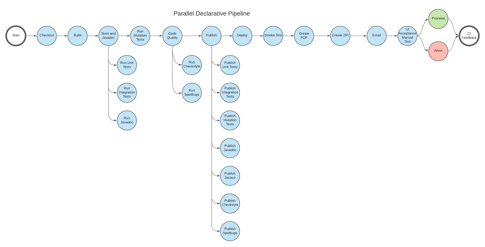

# Class assignment final - CMS Students

The current project took a two parts deliveries, where on the first delivery we had to build a pipeline with the following requirements for stages:

## Introduction
### Delivery one
`Pipeline Stages`

- **1** Repository Checkout Checkout the GIT repository;
- **2** War file Build and Publish the deployment file on Jenkins (e.g. for CMS: .war ) ;
- **3** Javadoc Generate and Publish the Javadoc on Jenkins;
- **4** Unit Tests Execution Execute the Unit Tests;
- **5** Unit Tests Report Generation and Publishing Generate and Publish the Unit Tests Report on Jenkins;
- **6** Unit Tests Report Coverage Report Generation and Publishing Generate and Publish the Unit Tests Coverage Report on Jenkins;
- **7** Integration Tests Execution Execute the Integration Tests;
- **8** Integration Tests Report Generation and Publishing Generate and Publish the Integration Tests Report on Jenkins;
- **9** Integration Tests Coverage Report Generation and Publishing Generate and Publish the Integration Tests Coverage Report on Jenkins;
- **13** Mutation Tests Execution Execute the Mutation Tests;
- **14** Mutation Tests Coverage Report Generation and Publishing Generate and Publish the Mutation Coverage Report on Jenkins;
- **15** System Test Deploy the application (e.g. .war file) to a pre-configured production server (e.g. Tomcat Server instance). Perform an automatic smoke test. This smoke test can be as simple as using curl to check if the base url of the application is responsive after staging deployment (e.g. on the Tomcat Server), ensuring that the application is properly deployed to the Staging Environment;
- **16** UI Acceptance Manual Tests A user should be notified by email of the successful execution of all the previous tests and be asked to perform a manual test. In order to cancel the progression or proceed, a UI Acceptance Manual Test must take place. The pipeline should wait for a user manual confirmation on Jenkins;
- **17** Continuous Integration Feedback Push a tag to the repository with the Jenkins build number and status (e.g. Build#32-Passed or Build#32-Failed).

For the propose of this class assignment some of the above stages were merged together. More details on the corresponding section.

It was also requested that the script would be compatible with both Unix and Windows systems.


### Delivery two

As for the second delivery it was necessary to keep the previous stages and enhance then while also given the project some additional features.
The additional features consist on the rework of the domain model of the project as well as the addition of the following business rules:
- a Book cannot be leased to different contacts at the same time
- Contacts cannot lease more than three books at a time
- Tags with the same description should not be allowed.

The image below illustrates the final result asked for the domain model:


Another relevant component of the delivery two was the improvement of the pipeline. It consisted on adding features to the pipeline that were connected to the elements of the group. In this project the concerns addressed were:
- 2.1 - Base Pipeline
- 2.2 - Documentation and Database
- 2.3 - Integration Tests and Code Quality

For more details regarding the requirements for the above points, see the document odsoft_project_assignment_v1.2.pdf available on moodle.

### Unix/Windows systems compatible
To achieve compatible between Unix and Windows operating systems, we have developed the following functions:

```Groovy
def command(command) {
    if (isUnix() && command != null) {
        sh command
    } else {
        bat command
    }
}

def directory(directory) {
  newDir=directory
  if (!isUnix()) {
    newDir = newDir.replace('/','\\')
  }
  return newDir
}
```
By checking the global function **isUnix** we can determine what action to take.
## Pipeline design



## Git module used
Considering the size of our team and the professional experience of the elements of the group, we decided to use Trunk-based development (TBD).
This resulted on small merges being done from branches that implementation/added some new feature or fixed a bug. This approach also made sure that, we always had a working version of the master, since every branch was created from the master branch.

## 2.1 - Base Pipeline
The application should have a persistence layer that must use a relational database.
PDF

## 2.2 - Documentation and Database
### Database
The database used for this step was a H2 database. This database is a relational database, allowing us to stablish relation between entities as well to have persistente data. Using the entity books as a example, we are able to use the decorator's **@Entity** and **@Table** to defined that a book entity should be created on the database with the field **id** being a primary key of type **UUID**.
Regarding the relations, the decorator's **ManyToMany** and **OneToMany** allow us stablish relations with the **Tag** and **Bookmark** entities. The **FetchType.EAGER** was used because gwt was using lazy loading and not getting the relations for this fields after the first call.
``` Java
@SuppressWarnings("serial")
@Entity
@Table
public class Book implements Serializable {
    @Id
    @GeneratedValue(generator = "UUID")
    private String id;
    private String title;
    private String isbn;
    private String author;
    @ManyToMany(fetch = FetchType.EAGER)
    private List<Tag> tags;
    @OneToMany(fetch = FetchType.EAGER)
    private List<Bookmark> bookmarks;
...
}
```

### Project ZIP
As part of this concern, was also asked to create a zip containing all the project relevante data. To achieve this we used the following gradle task:
```Groovy
task zipCMSProject(type: Zip) {
    from '../../'
    // code
    exclude '/project/cms_students/.gradle/'
    exclude '/project/cms_students/.idea/'
    exclude '/project/cms_students/bin/'
    exclude '/project/cms_students/build/'
    exclude '/project/cms_students/gwt-unitCache/'
    exclude '/project/cms_students/www-test/'
    include '/project/cms_students/**'
    // documentation
    include '/odsoft/class_assignment_final/**/**'
    archiveName 'cms_project.zip'
}
```
This will create a zip file on `project/cms_students/build/distributions/cms_project.zip` that is archive on jenkins.

### Advanced task
As advanced task for this concern, it has requested that the Gradle version and JDK where upgrade. This task was partially done, since we only where able to upgrade Gradle to the version 7.3.3. This also involved upgrading the gwt to the 2.9.0 version, and using a fork os 'fr.putnami.gwt', called 'de.esoco.gwt', to be able to use gwt.
Other changes where the update of **testCompile** to **testImplementation** and **compile** to **implementation**.

## 2.3 - Integration Tests and Code Quality

### Integration Tests

After developing the new entities for the CMS application, there was the need to implement Integration tests, in order to cover them. For that reason, the team used the tests already in existence as a base model for developing the new tests.

These tests can be found under the _/test_ folder on the source code of the project. Integration tests classes can be easily identified by its suffix _GWTTest_, as stated in the _build.gradle_ related task. For each entity, the developed integration tests cover the sorting method and the entity service.

In order to run the integration tests we call the _build.gradle_ task in Jenkins' command line, using the Gradle wrapper, as follows:

```Groovy
stage("Run Integration Tests") {
    steps {
        dir(directory("${env.WORKSPACE}/project/cms_students")) {
            command("./gradlew integrationTest")
        }
    }
}
```

As we can see, the command is written inside a method, named _command_. This method will verify if the script is running on a Linux-based operating system or on a Windows computer. By doing so, we can test this same script in a variety of systems.

The integration tests are ran in parallel with the unit tests and the Javadoc generation, in order to be more efficient and keep the script organized.

By running this instruction, the task will produce an HTML report, that can be found on the _/reports_ folder, which is going to store all of the reports generated by the tasks. As a project's requirement, this report must be published and archived.

The report publication is possible due to the use of the Jenkins' plugin _publishHTML_. With this plugin we can point to the desired report and give it a name. When it's published, we can find the report in the job's dashboard.

To archive the report as an artifact, we've created a post build action. This post build action consist in calling another plugin, named _archiveArtifacs_, which will have the report's directory and is going to archive it.

```Groovy
archiveArtifacts artifacts: 'project/cms_students/build/reports/integrationTest/index.html', followSymlinks: false
```

After running the pipeline successfully, we should see something as seen in the following screenshot.


### Checkstyle

One of the tools used to do a "check" on the code quality of the project is Checkstyle.

The first step to take advantage of this tool is to create a new task on _build.gradle_. Firstly we import the plugin, in order for the file to recognize the tasks that are going to be created.

After that we must configure the task. We must select the version, the configuration file and if failures must be ignored or not. For the configuration file we've created a configuration folder, which won't just be used for this tool. The Checkstyle configuration file can be found under _/checkstyle_ and is an XML file, whose content is based on a template found on the Internet. 

The other configuration is to decide which type of reports we desire to generate. As we can see up next, the team went for an HTML report, instead of an XML report.


The next step was to create two tasks, one which is going to analyze the source code, and the other the test code. For each task, the only parameter to be set is the directory of the code we want to analyze, as we can see in the following screenshot.


The next step is to ran this tool in the Jenkins' pipeline. To do so, we created a stage named "Code Quality", which will run the tools used to check the code quality in parallel. In this stage we just execute a command calling the Gradle task, using the method previously described, that confirms the operating system on which the script is running.

According to the project's requirements, this tool's report must also be published but, since settings for code quality should be defined, including the thresholds for the build health, we couldn't just use the _publishHTML_ plugin. Instead, we decided to use the _Warnings Next Generation_ plugin, which allows to set the required values.

```Groovy
recordIssues enabledForFailure: true, tools: [checkStyle(pattern: "/build/reports/checkstyle/*main*.xml")],tool: java(pattern: '*.log'), healthy: 200, unhealthy: 600
```

We point to the report's directory and set the threshold values. The two values, 200 for _healthy_, and 600 for _unhealthy_ mean that a build is considered stable if there are 200 or less errors, unstable if there are between 200 and 600 errors, and is going to fail if there are more than 600 errors.

The report can be found on the job's dashboard, and is going to have the following aspect.


It's possible to see an Overview of the tool's report, a graphic with an history of the number of errors per build, and allows to see the errors per Package, File, Category, Type and Issue.

By analyzing the report we can see that the tool found a little over 400 errors in the latest 4 builds, which means they're not very stable, but they still don't fail as there weren't enough errors in order for that to happen.

On the Category view it's clear that most of the errors found in the project are related to Javadoc, with 121 errors, followed by 90 errors on Imports. The third category with most errors is Whitespace, with a total of 89 errors.


By analyzing the Type view, errors related to Javadoc are dominant, with 121 errors again. There are also 52 errors with the Imports, and 43 errors associated with the placement of left curly braces ('{').


To archive this report, as requested, the same method used to archive the integration tests artifact was used.

### Spotbugs

Since the second suggested tool for doing a "check" on the code quality of the project, Findbugs, is not available on the used Gradle version, we opted for Spotbugs, which is a fork from the first.

This tool also requires to create a new task on _build.gradle_. Firstly we import the plugin, in order for the file to recognize the tasks that are going to be created.

```Groovy
id "com.github.spotbugs" version "5.0.4"
```

Configuration is also needed. We select if failures must be ignored or not and the type of report we want to generate, either XML or HTML. The report's directory is the task's default, and is set to the folder where all the others tasks store their reports, _/build/reports_. Like in Checkstyle, there is the need to decide which type of reports we desire to generate. As we can see up next, the team went for an XML report, instead of an HTML report.


The tasks in this tool are implicit and don't need any configuration, as opposed to Checkstyle.

This tool is also ran in the Jenkins' pipeline. To do so, we created a stage named "Run Spotbugs", inside "Code Quality" stage. In this stage we just execute a command calling the Gradle task, using the method that confirms the operating system on which the script is running.

```Groovy
stage("Run SpotBugs") {
    steps {
        dir(directory("${env.WORKSPACE}/project/cms_students")) {
            command("./gradlew spotbugsMain")
        }
    }
}
```

This tool's report must also be published but, since settings for code quality should be defined we decided to use the _Warnings Next Generation_ plugin once again, like so:

```Groovy
stage("Spotbugs") {
     steps {
        dir(directory("${env.WORKSPACE}/project/cms_students")) {
            recordIssues enabledForFailure: true, tools: [spotBugs(pattern: "/build/reports/spotbugs/*.xml")],tool: java(pattern: '*.log'), healthy: 100, unhealthy: 300
        }
    }
}
```

We point to the report's directory and set the threshold values.

The report can be found on the job's dashboard, and is going to have the same aspect as the other tool's, with an Overview, an History per build and a detailed report.

On the Type view, the *EI_EXPOSE_REP2* error stands out from the others, as it has 84 occurrences, compared to the 53 from the second most common error. This error means that there are 84 times where object instances are accessed by untrusted code, and unchecked changes to the mutable object would compromise security or other important properties. One way to avoid this vulnerability is to storing a copy of the object.


Another interesting analysis that can be done is to the Categories view. It is blatantly obvious that there's a vunerability in the project's source code, due to the 162 occurances of the *MALICIOUS_CODE* code, which means that there's a large portion of code which is vulnerable to attacks from untrusted code.


This report was also archived, using the previously used plugin .

## Maturity level

- Maturity Level: Build Management and Continuous Integration - Level 0
- Maturity Level: Environments and Deployment - Level 0
- Maturity Level: Release Management and Compliance - Level 1
- Maturity Level: Testing - Level 0
- Maturity Level: Data Management - Level -1
- Maturity Level: Configuration Management - Level 0