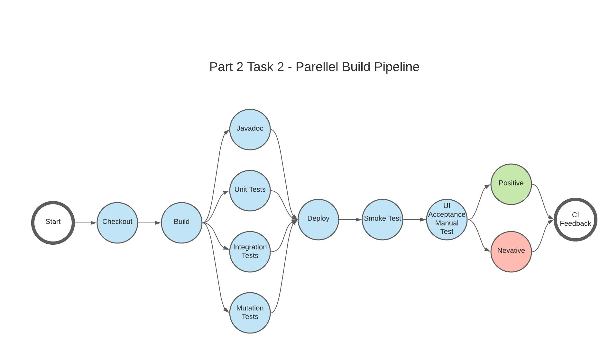
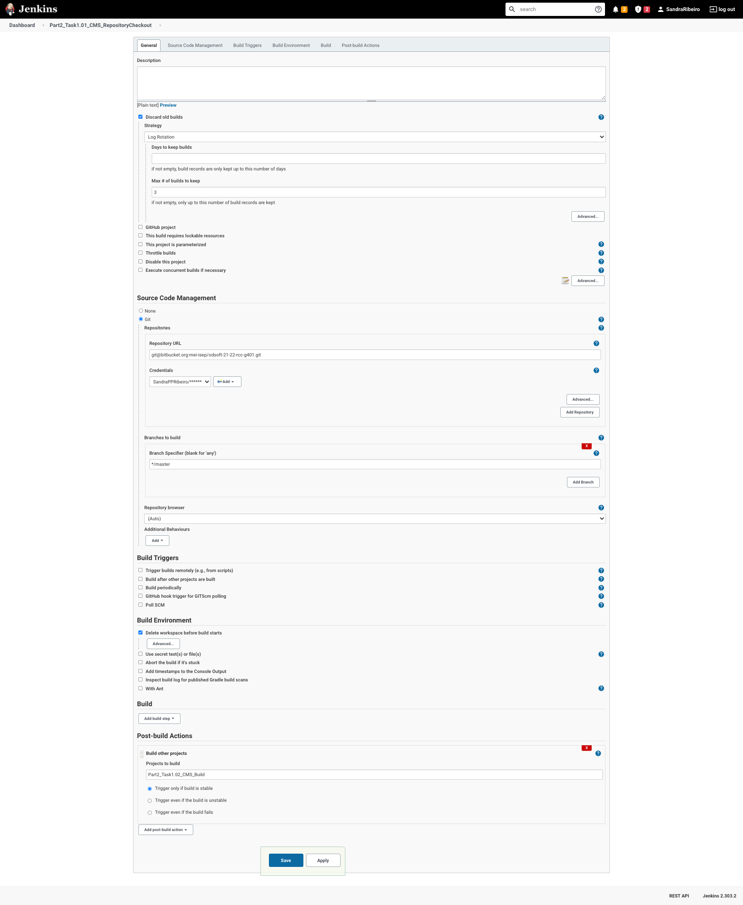
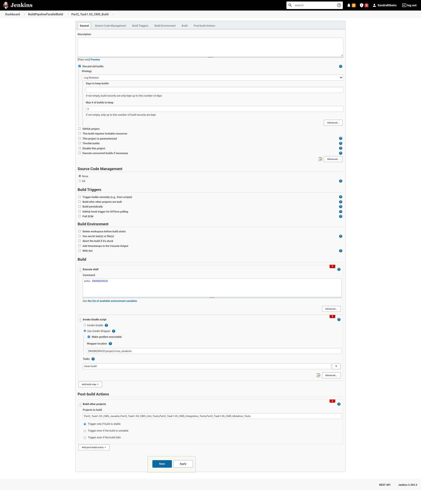
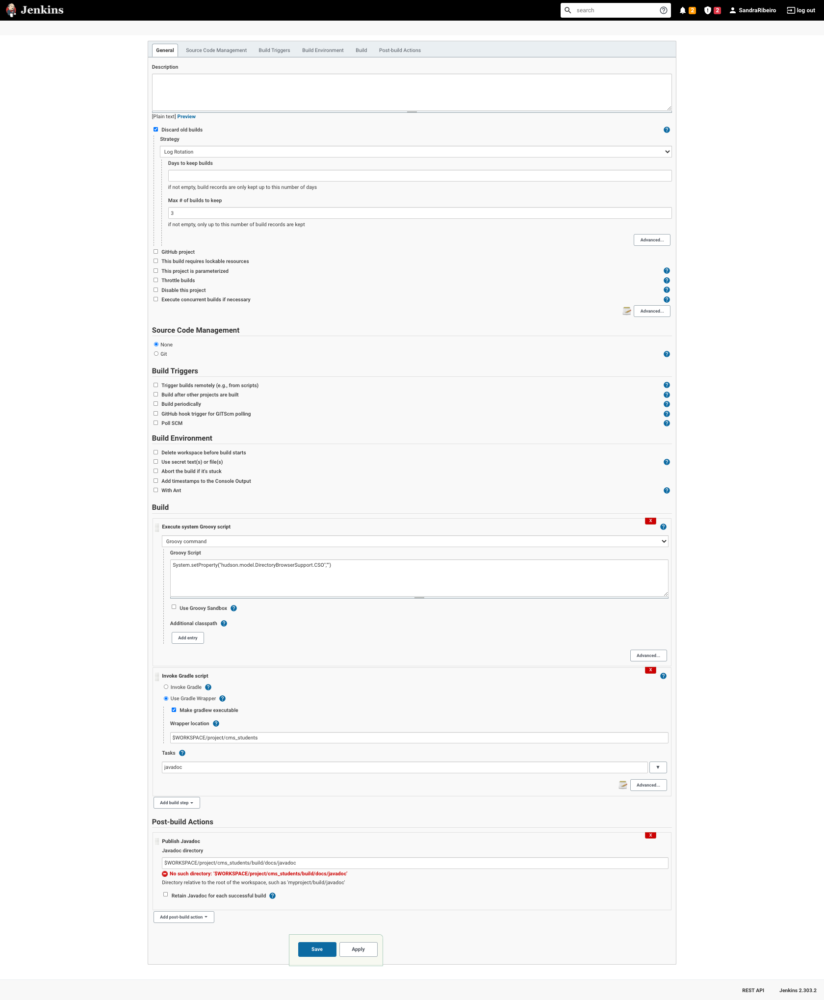
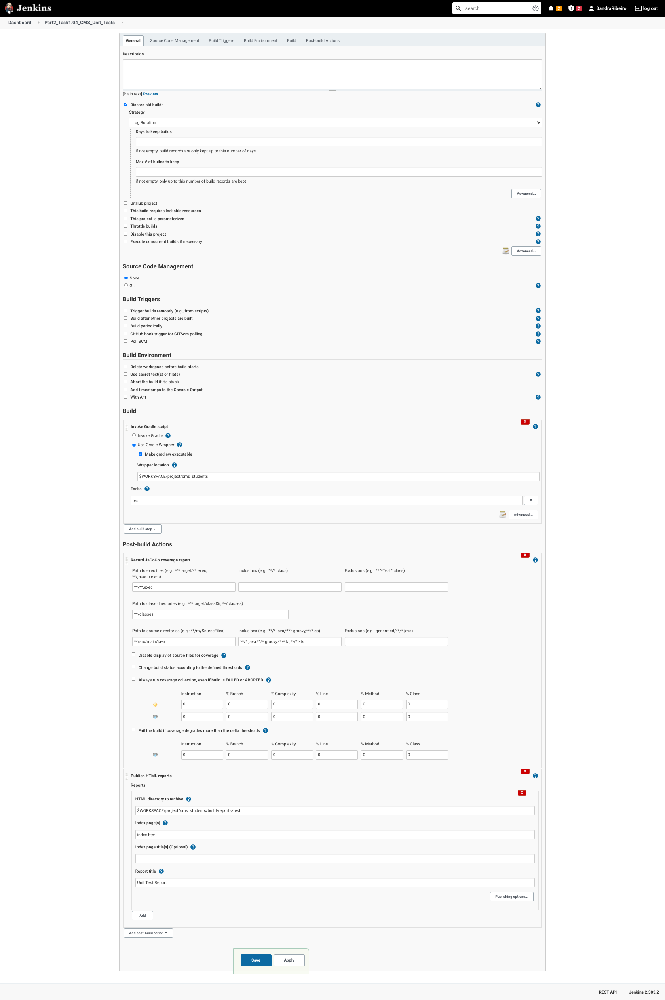
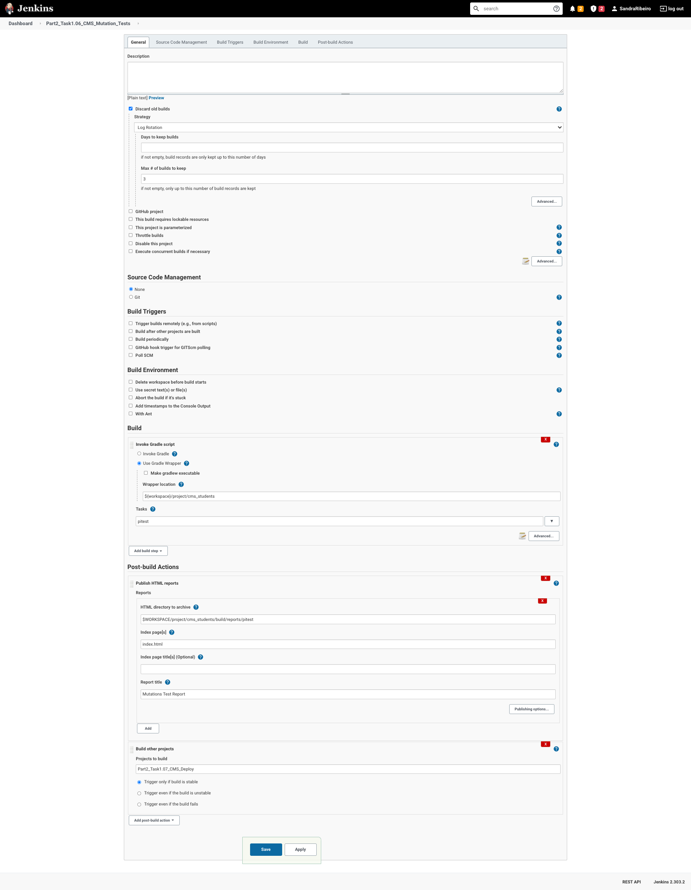
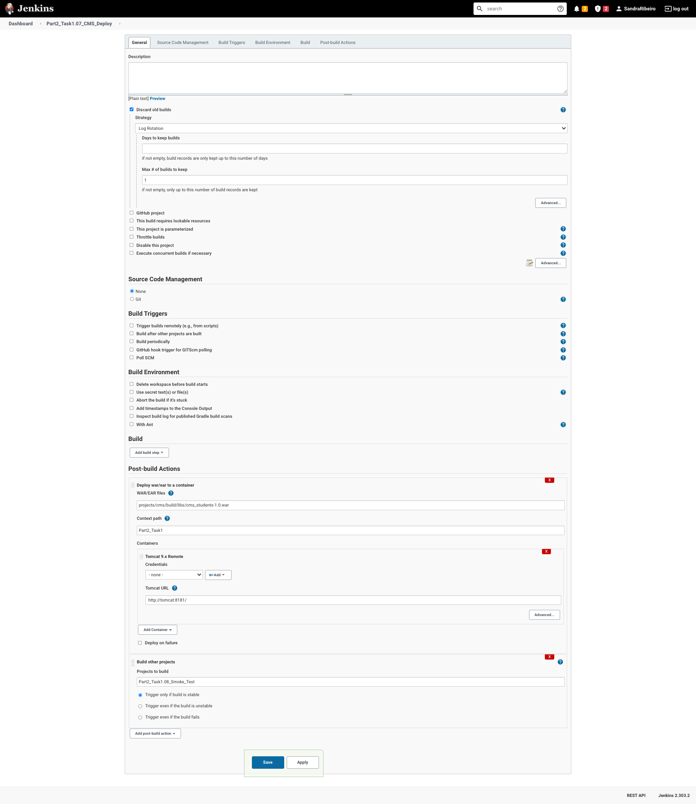
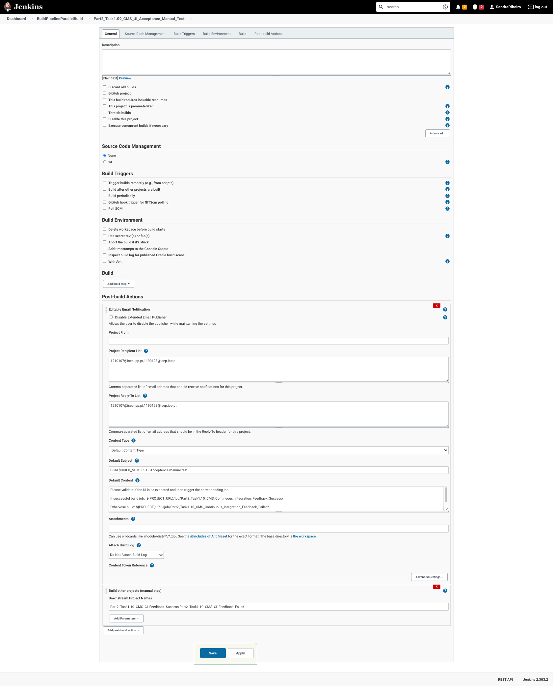
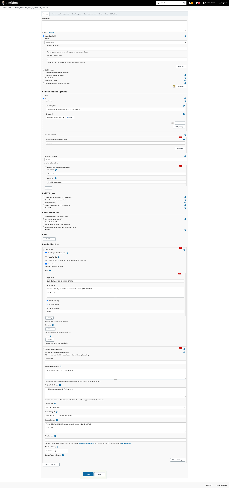
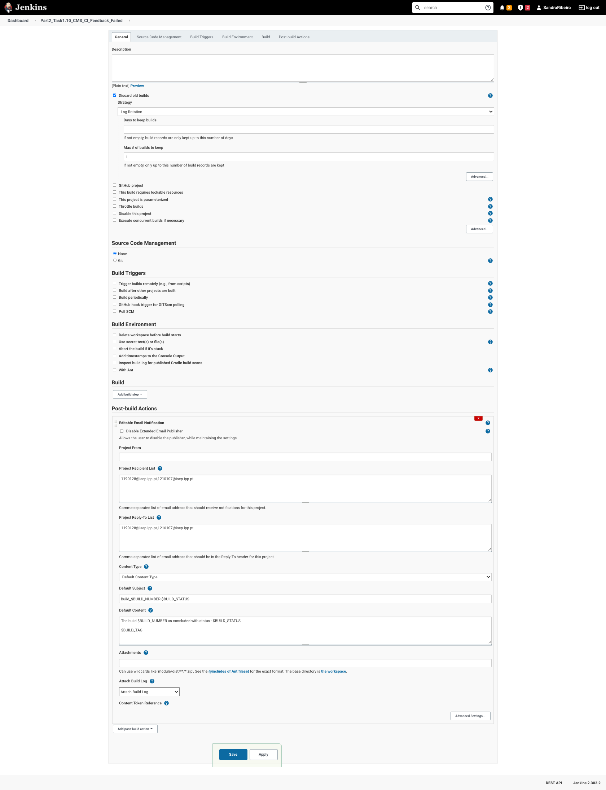

# Class assignment Part 2 (CMS Students) Task 2

## Requirements

The presented class assignment is done under the context of the below task context.

**Task 2** - Configure a Jenkins Pipeline using the “Promoted Build” or “Build
Pipeline” plugin, to perform a parallel build;

As for the pipeline stages, it was given the following Stages:

`Pipeline Stages`

- **1** Repository Checkout Checkout the GIT repository;
- **2** War file Build and Publish the deployment file on Jenkins (e.g. for CMS: .war ) ;
- **3** Javadoc Generate and Publish the Javadoc on Jenkins;
- **4** Unit Tests Execution;
- **5** Integration Tests Execution, Report Generation and Publishing Generate and Publish the Integration Tests Report on Jenkins;
- **6** Mutation Tests Execution, Report Coverage Report Generation and Publishing Generate and Publish the Mutation Tests Coverage Report on Jenkins;
- **7** System Test Deploy the application (e.g. .war file) to a pre-configured production server (e.g. Tomcat Server instance). Perform an automatic smoke test. This smoke test can be as simple as using curl to check if the base url of the application is responsive after staging deployment (e.g. on the Tomcat Server), ensuring that the application is properly deployed to the Staging Environment;
- **8** Smoke Tests Execution,Report Generation and Publishing Generate and Publish the Integration Tests Report on Jenkins;
- **9** UI Acceptance Manual Tests A user should be notified by email of the successful execution of all the previous tests and be asked to perform a manual test. In order to cancel the progression or proceed, a UI Acceptance Manual Test must take place. The pipeline should wait for a user manual confirmation on Jenkins;
- **10** Continuous Integration Feedback Push a tag to the repository with the Jenkins build number and status (e.g. Build#32-Passed or Build#32-Failed).

For the propose of this class assignment some of the above stages were merged together. More details on the corresponding section.

# Introduction

## Development Setup

We used a docker-compose based solution where we created two service:

- One for `jenkins`
- Another for `tomcat`

## Plugin choose

We choose to go with [Build Pipeline](https://plugins.jenkins.io/build-pipeline-plugin/) plugin. Our criteria was made based on the number of installs between the to given plugin:

- 32,788 installs `Build Pipeline` at 22/11/2021
- 12,267 installs `Promoted Build` at 22/11/2021

This criteria was used because it would increase the changes of finding support on forums (e.g. Stackoverflow).

## Pipeline design

This approach was design having in mind that some jobs are execute in a parallel. On the **UI Acceptance Manual Tests** is it expected that the user triggers **Failed** or **Success** so that the pipeline finishes and link to jobs are included on the email sent.


We choose a design that wanted to accomplish that some jobs executed simultaneous would make full pipeline run faster. For that reason automated tests, such us, Unit, Integrations and Mutation and also Javadoc are done at the same time.

## Checkout

This task has the propose of creating a custom workspace to be used by the following jobs. It also deletes the workspace before it starts.

Regarding the **Source Code Management** section, we use both ssh and https. In the image below show the implementation with https.

The job finishes doing a **Post-build Actions** that has the propose of triggering the next job, **Part2_Task1.02_CMS_Build** in this case.


## Build

As for the Build job, we are using the **Custom workspace**, previously created - **Part2_Task1_CMS_Workspace** - and since we already have the checkout done, on the **Source Code Management** we choose **None** to not overwrite the previous job.

Regarding the build in itself, we are using the **gradle wrapper** that already came with the project, but it could be also used the gradle, if properly configured with the version requested for the project. We start by specifying the wrapper location with **${workspace}/project/cms_students** and defining the tasks **clean build** to be execute. **clean** to remove any previous artifacts that could be wrongfully sent to the repo, and **build** to initiate the build itself. Since we have a project within a project (our build.gradle isn't top level) we must specify the **Root Build script** that in this case is the same as the wrapper location.

The job finishes doing a **Post-build Actions** that has the propose of triggering the next jobs, **Part2_Task1.03_CMS_Javadoc**, **Part2_Task1.04_CMS_Unit_Tests**, **Part2_Task1.05_CMS_Integration_Tests** and **Part2_Task1.06_CMS_Mutation_Tests**.



## Javadoc

The current job as the task of generating the documentation for the project.

Once again, we use the same workspace **Part2_Task1_CMS_Workspace** and there is no need to specify **Source Code Management**

Jenkins introduced a [Security Policy](https://www.jenkins.io/doc/book/security/configuring-content-security-policy/), which made that no JavaScript, CSS, images (more details on the link), were possible to serve/view by accessing the html pages. To overcome this, we added a **Build** step to **Execute system Groovy script** that will change the jenkins configurations regarding this security policy. More info regarding the script used [here](https://stackoverflow.com/a/46197356/9915287).

Similarly with the previous job - **Build**- to generate the **Javadoc** we use the wrapper with the same logic previously explained for the location and root. The task that we need to run to create the Javadoc is simply **javadoc**

As for **Post-build Actions**, we have two.

The first one, **Publish Javadoc** where we specify the directory where the docs will be located.



## Unit Tests

Unit tests have the propose of ensuring the a section of an application meets its design and has the expected behavior.

Once again, we use the same workspace **Part2_Task1_CMS_Workspace** and there is no need to specify **Source Code Management**

Similarly with the previous job - **Build**- to run **Unit Tests** we use the wrapper with the same logic previously explained for the location and root. The task that we need to run is simply **test**

The first **Post-build Actions**, **Record JaCoCo coverage report**, we specify the name of the **.exec** file in the **Path to exec files** field, with **\*\*test.exec**.
The second **Post-build Actions**, we use the plugin [HTML Publisher](https://plugins.jenkins.io/htmlpublisher/) to publish the report generated, regarding what test pass/failed, with some additional information. We specify the directory with **${workspace}/project/cms_students/build/reports/test** and the page with **index.html**.



## Integration Tests

Integration tests have the propose of combining and testing modules.

Once again, we use the same workspace **Part2_Task1_CMS_Workspace** and there is no need to specify **Source Code Management**

To be able to run the integration tests we need to had to the file **project/cms_students/src/main/java/pt/isep/cms/Showcase.gwt.xml/** the below code:

```
line 35 ->  <set-property name="user.agent" value="safari, ie9, gecko1_8" />
```

Similarly with the previous job - **Build**- to run **Integration Tests** we use the wrapper with the same logic previously explained for the location and root. The task that we need to run is simply **integrationTest**

The first **Post-build Actions**, **Record JaCoCo coverage report**, we specify the name of the **.exec** file in the **Path to exec files** field, with **\*\*integrationTest.exec**.
The second **Post-build Actions**, we use the plugin [HTML Publisher](https://plugins.jenkins.io/htmlpublisher/) to publish the report generated, regarding what test pass/failed, with some adicional information. We specify the directory with **${workspace}/project/cms_students/build/reports/integrationTest** and the page with **index.html**.


## Mutation Tests

Mutation tests are a form of withe-box testing. Involves modifying the application in small ways to identify weakly tested pieces of code and weak tests.

Once again, we use the same workspace **Part2_Task1_CMS_Workspace** and there is no need to specify **Source Code Management**

To run mutation test, we had to install [pitest](https://pitest.org/) and add it to the build.gradle.

Similarly with the previous job - **Build**- to run **Mutation Tests** we use the wrapper with the same logic previously explained for the location and root. The task that we need to run is simply **pitest**.

The first **Post-build Actions**, we use the plugin [HTML Publisher](https://plugins.jenkins.io/htmlpublisher/) to publish the report generated, regarding what test pass/failed, with some adicional information. We specify the directory with **${workspace}/project/cms_students/build/reports/pitest** and the page with **index.html**
The last **Post-build Actions** finishes by triggering the next job, **Part2_Task1.07_CMS_Deploy** in this case.



## Deploy

Regarding the deploy, we will be using a docker image of `tomcat` to make the build available. To do so, we had to install the [Deploy to container](https://plugins.jenkins.io/deploy/) plugin.

Once again, we use the same workspace **Part2_Task1_CMS_Workspace** and there is no need to
specify **Source Code Management**

This job executes two **Post-build Actions**.

The first action, **Deploy war/ear to a container** has the propose of sending the build that we generated on the **Build** step, a the `tomcat` container. To do so, we need to:

- Specifying the **War/EAR files** -> **project/cms_students/build/libs/cms_students-1.0.war**
- Specifying the **Context path** (This is simply the folder where the project will be deploy on the tomcat/webapps) -> Part2_Task1
- Specify the Container in which we want to deploy. This is composed by two steps.
  - Credentials
  - Tomcat URL

#### Credentials

The credential step is achieved by modifying the **/usr/local/tomcat/conf/tomcat-users.xml** and creating the desired users. In this case we used the following markdown:

```HTML
<?xml version="1.0" encoding="UTF-8"?>
<tomcat-users xmlns="http://tomcat.apache.org/xml" xmlns:xsi="http://www.w3.org/2001/XMLSchema-instance" xsi:schemaLocation="http://tomcat.apache.org/xml tomcat-users.xsd" version="1.0">
    <role rolename="manager-gui" />
    <role rolename="manager-script" />
    <role rolename="manager-jmx" />
    <role rolename="manager-status" />
    <user username="admin" password="admin" roles="manager-gui, manager-script, manager-jmx, manager-status" />
    <user username="deployer" password="deployer" roles="manager-script" />
    <user username="tomcat" password="s3cret" roles="manager-gui" />
</tomcat-users>
```

To execute the step itself we used the **deployer** user.

#### Tomcat URL

Taking advantage of the docker-compose network we simply used **http://tomcat:8181/** to stablish connection with the `tomcat` container.



The last **Post-build Actions** finishes by triggering the next job, **Part2_Task1.08_Smoke_Test** in this case.

## Smoke Test

To do the **Smoke Test** job we dont need nether the workspace nor the **Source Code Management** since we will just check if the project was deployed correctly.

In the **Build** step, we choose the **Execute shell** to be able to do a custom shell command that is as follows:

```bash
curl -v --silent http://tomcat:8181/Part2_Task1/Showcase.html\#\!CwContacts --stderr - | if grep -q "Amelie Crutcher"
then
    echo "Amelia was found!"
else
	echo "Amelia wasn't found!"
    exit 1
fi
```

Doing a _curl_ to one of the expected urls, we will do a _grep_ to look for a string, in this case _"Amelie Crutcher"_. If we don't find it, we exit with a non zero exit value, if we do, we just print a echo.

The job finishes by doing a **Post-build Actions** that has the propose of triggering the next job, **Part2_Task1.09_CMS_UI_Acceptance_Manual_Test** in this case.


## UI Acceptance Manual Test

To do the **UI Acceptance Manual Test** job we dont need nether the workspace nor the **Source Code Management** since we will just check if the UI is correctly presented.

This job has two **Post-build Actions**.exec\*\*

The first action, **Editable Email Notification** will send an email to the **Project Recipient List** informing that the pipeline is waiting for the UI approval.

The last action, **Build other projects (manual step)**, will add both Part2_Task1.10_CMS_CI_Feedback_Success and Part2_Task1.10_CMS_CI_Feedback_Failed as part of the pipeline. After the user checks how the UI is, he should do a manual execution of the corresponding job.

### Sending emails

To be able to send email it was need to configure an _SMTP_ server under:

Manage Jenkins -> Configure System -> Extended E-mail Notification
Here we should set:

- SMTP server
  - smtp.gmail.com (is the server that we use)
  - 465
  - Credentials (it was used an personal gmail account with third parties application allowed credentials)
  - Use SSL

The same should be done for:
Manage Jenkins -> Configure System -> E-mail Notification
Here we should set:

- SMTP server
  - smtp.gmail.com (is the server that we use)
  - 465
  - Credentials (it was used an personal gmail account with third parties application allowed credentials)
  - Use SSL

This replicated step looks to be a bug of jenkins, because if both weren't configured, no email was sent.

On the email a link is sent for the user to trigger the correct jobs, in case of success or failure.



## CI Feedback Success

This task has the propose of creating a tag on the Bitbucket repository and notifying users by email.

To be able to push the tag to the Bitbucket repository, we must specify **Source Code Management** again, and this time also specify then **Name** of the repo, as **origin**. This will allow us to reference this repo on the next steps. To prevent overwriting the existing workspace **Part2_Task1_CMS_Workspace**, we created a new one, **Part2_Task1_CMS_Workspace_2**.
We also need to add a **Additional Behaviours** to specify the _user.email_ and _user .name_ that should be used to authenticate on the Bitbucket server.

Lastly we have two **Post-build Actions**.

The first one, **Git Publisher**, will facilitate the creation of a new tag repo. We use _Force Push_ to ensure that the tag gets created, and we define our tag with the $BUILD_NUMBER and the previously configured parameter, $BUILD_STATUS. We specify that we want to create and/or update a new tag, and the **Target remote name** is will be **origin**, corresponding to the repository that we configured above.

Another way that we could create a tag, would be by doing a **BUILD STEP** were we **Execute shell** and we manually written the necessary commands to create the new tag.

The final action, we just send a email to the user informing that the pipeline as concluded with our $BUILD_STATUS and the logs with attachment.



## CI Feedback Failed

This task has the propose notifying users by email.

The action, we just send a email to the user informing that the pipeline as concluded with our $BUILD_STATUS and the logs with attachment.


