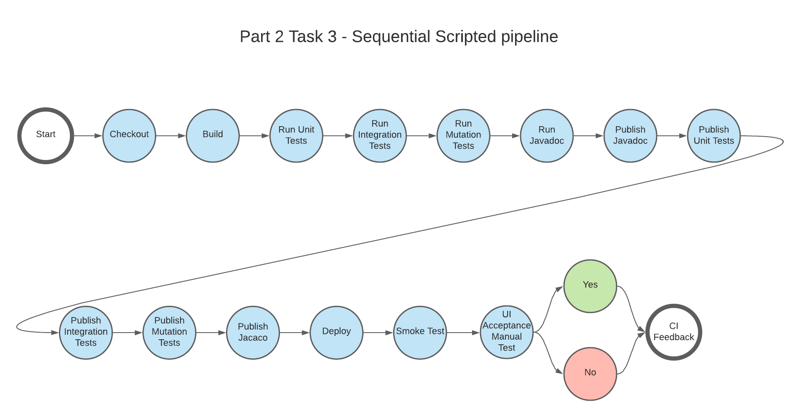

# Class assignment Part 2 (CMS Students) Task 3

## Requirements

The presented class assignment is done under the context of the below task context.

**Task 3** - Configure a Jenkins Pipeline using a Scripted Pipeline , to perform a sequential build;

As for the pipeline stages, it was given the following Stages:

`Pipeline Stages`

- **1** Repository Checkout Checkout the GIT repository;
- **2** War file Build and Publish the deployment file on Jenkins (e.g. for CMS: .war ) ;
- **3** Javadoc Generate and Publish the Javadoc on Jenkins;
- **4** Unit Tests Execution Execute the Unit Tests;
- **5** Unit Tests Report Generation and Publishing Generate and Publish the Unit Tests Report on Jenkins;
- **6** Unit Tests Report Coverage Report Generation and Publishing Generate and Publish the Unit Tests Coverage Report on Jenkins;
- **7** Integration Tests Execution Execute the Integration Tests;
- **8** Integration Tests Report Generation and Publishing Generate and Publish the Integration Tests Report on Jenkins;
- **9** Integration Tests Coverage Report Generation and Publishing Generate and Publish the Integration Tests Coverage Report on Jenkins;
- **13** Mutation Tests Execution Execute the Mutation Tests;
- **14** Mutation Tests Coverage Report Generation and Publishing Generate and Publish the Mutation Coverage Report on Jenkins;
- **15** System Test Deploy the application (e.g. .war file) to a pre-configured production server (e.g. Tomcat Server instance). Perform an automatic smoke test. This smoke test can be as simple as using curl to check if the base url of the application is responsive after staging deployment (e.g. on the Tomcat Server), ensuring that the application is properly deployed to the Staging Environment;
- **16** UI Acceptance Manual Tests A user should be notified by email of the successful execution of all the previous tests and be asked to perform a manual test. In order to cancel the progression or proceed, a UI Acceptance Manual Test must take place. The pipeline should wait for a user manual confirmation on Jenkins;
- **17** Continuous Integration Feedback Push a tag to the repository with the Jenkins build number and status (e.g. Build#32-Passed or Build#32-Failed).

For the propose of this class assignment some of the above stages were merged together. More details on the corresponding section.

It was also requested that the script would be compatible with both Unix and Windows systems.

# Introduction

## Development Setup

We used a docker-compose based solution where we created two service:

- One for `jenkins`
- Another for `tomcat`

## Pipeline design

This approach was design having in mind that the stages should execute in parallel, so in this implementation we have stages where we execute multiple jobs at given time. We choose the **Tests and Javadoc** and **Publish** stages to have parallel executions because they don't have any all the steps of this stages have the precedent dependencies.


We choose a design that wanted to accomplish the failing fast strategy, where the point was to have the jobs that could fail more easily being executed first.

## Unix/Windows systems compatible

To achieve this compatible, we have developed the following functions:

```Groovy
def command(command) {
    if (isUnix() && command != null) {
        sh command
    } else {
        bat command
    }
}

def directory(directory) {
  newDir=directory
  if (!isUnix()) {
    newDir = newDir.replace('/','\\')
  }
  return newDir
}
```

On the `command` function, we created a function that will execute **sh** or **bat** based on the result of the `isUnix()` function. This function is global available in jenkins scripts.
Below a example of its usage:

```Groovy
command("./gradlew clean build")
```

Regarding the `directory` function, the function receives by parameters an directory path, that will have its slash's replaced if the file isn't running on a Unix based system.
Below a example of its usage:

```Groovy
directory("${env.WORKSPACE}/project/cms_students")
```
