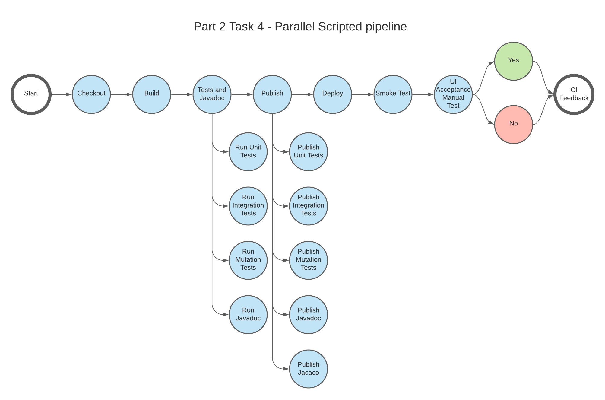
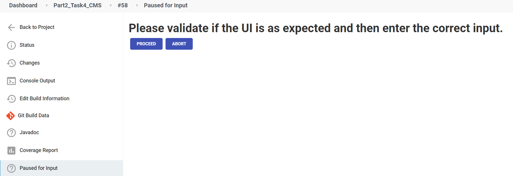

# Class assignment Part 2 (CMS Students) Task 4

## Requirements

The presented class assignment is done under the context of the below task context.

**Task 4** - ask 4 Configure a Jenkins Pipeline using a Scripted Pipeline, to perform a parallel build.

As for the pipeline stages, it was given the following Stages:

`Pipeline Stages`

- **1** Repository Checkout Checkout the GIT repository;
- **2** War file Build and Publish the deployment file on Jenkins (e.g. for CMS: .war ) ;
- **3** Javadoc Generate and Publish the Javadoc on Jenkins;
- **4** Unit Tests Execution Execute the Unit Tests;
- **5** Unit Tests Report Generation and Publishing Generate and Publish the Unit Tests Report on Jenkins;
- **6** Unit Tests Report Coverage Report Generation and Publishing Generate and Publish the Unit Tests Coverage Report on Jenkins;
- **7** Integration Tests Execution Execute the Integration Tests;
- **8** Integration Tests Report Generation and Publishing Generate and Publish the Integration Tests Report on Jenkins;
- **9** Integration Tests Coverage Report Generation and Publishing Generate and Publish the Integration Tests Coverage Report on Jenkins;
- **13** Mutation Tests Execution Execute the Mutation Tests;
- **14** Mutation Tests Coverage Report Generation and Publishing Generate and Publish the Mutation Coverage Report on Jenkins;
- **15** System Test Deploy the application (e.g. .war file) to a pre-configured production server (e.g. Tomcat Server instance). Perform an automatic smoke test. This smoke test can be as simple as using curl to check if the base url of the application is responsive after staging deployment (e.g. on the Tomcat Server), ensuring that the application is properly deployed to the Staging Environment;
- **16** UI Acceptance Manual Tests A user should be notified by email of the successful execution of all the previous tests and be asked to perform a manual test. In order to cancel the progression or proceed, a UI Acceptance Manual Test must take place. The pipeline should wait for a user manual confirmation on Jenkins;
- **17** Continuous Integration Feedback Push a tag to the repository with the Jenkins build number and status (e.g. Build#32-Passed or Build#32-Failed).

For the propose of this class assignment some of the above stages were merged together. More details on the corresponding section.

It was also requested that the script would be compatible with both Unix and Windows systems.

# Introduction

## Development Setup

We used a docker-compose based solution where we created two service:

- One for `jenkins`
- Another for `tomcat`

## Pipeline design

This approach was design having in mind that the stages should execute in parallel, so in this implementation we have stages where we execute multiple jobs at given time. We choose the **Tests and Javadoc** and **Publish** stages to have parallel executions because they don't have any all the steps of this stages have the precedent dependencies.


We choose a design that wanted to accomplish the failing fast strategy, where the point was to have the jobs that could fail more easily being executed first.

## Unix/Windows systems compatible

To achieve this compatible, we have developed the following functions:

```Groovy
def command(command) {
    if (isUnix() && command != null) {
        sh command
    } else {
        bat command
    }
}

def directory(directory) {
  newDir=directory
  if (!isUnix()) {
    newDir = newDir.replace('/','\\')
  }
  return newDir
}
```

On the `command` function, we created a function that will execute **sh** or **bat** based on the result of the `isUnix()` function. This function is global available in jenkins scripts.
Below a example of its usage:

```Groovy
command("./gradlew clean build")
```

Regarding the `directory` function, the function receives by parameters an directory path, that will have its slash's replaced if the file isn't running on a Unix based system.
Below a example of its usage:

```Groovy
directory("${env.WORKSPACE}/project/cms_students")
```

## Checkout

This task has the propose of updating the local workspace to be followed bt the pipeline stages. It also deletes the workspace before it starts. To do so we use the following code:

```Groovy
stage("Checkout") {
    steps {
        checkout([
                $class: "GitSCM",
                branches: [[name: "*/master"]],
                extensions: [[$class: "WipeWorkspace"]],
                userRemoteConfigs: [
                    [credentialsId: "333bd6ce-1181-4a3f-975c-5f15aecd87dd",
                    name: "origin",
                    url: "git@bitbucket.org:mei-isep/odsoft-21-22-rcc-g401.git"]
                ]
            ])
    }
}
```

We builded the above command using the "Pipeline Syntax", which is a GUI for generating snippets for the steps.

In this step we, defined the version control, clean the workspace, and specify the credentialsId using the jenkins allocated uid as well as the url to be used. In this case we are using ssh.

## Build

To validate if the repo has a valid build, we starting by building the project itself. In the below stage, we are execute a step which simply changes the current directory to the place were the project is located, and executes the gradle wrapper to initiate the build process. We use **clean** the ensure that no desired artifact is on the build folder.

```Groovy
stage("Build") {
    steps {
            dir(directory("${env.WORKSPACE}/project/cms_students")) {
                command("./gradlew clean build")
            }
    }
}
```

## Tests and Javadoc

In this stage, we defined that we were going to run all our tests in parallel while also generating the javadoc. This decision was made because we don't have any precedent besides the build.

To achieve this we created the below stage:

```Groovy
stage("Tests and Javadoc") {
    parallel {
        stage("Run Unit Tests") {
            steps {
                dir(directory("${env.WORKSPACE}/project/cms_students")) {
                    command("./gradlew test")
                }
            }
        }
        stage("Run Integration Tests") {
            steps {
                dir(directory("${env.WORKSPACE}/project/cms_students")) {
                    command("./gradlew integrationTest")
                }
            }
        }
        stage("Run Mutation Tests") {
            steps {
                dir(directory("${env.WORKSPACE}/project/cms_students")) {
                    command("./gradlew pitest")
                }
            }
        }
        stage("Run Javadoc") {
            steps {
                dir(directory("${env.WORKSPACE}/project/cms_students")) {
                    command("./gradlew javadoc")
                }
            }
        }
    }
}
```

To have the tests and javadoc generation running in parallel we have to define stages, inside the "father" stage. Which "child" stage has is steps and commands to execute. We had to use the above structure because it is how Jenkins script work for parallel stages.

## Publish

For the publish stage, we have to use the same structure explained above to achieve the parallel execution.

All the below "child" stages steps, where build using the Pipeline Syntax. They have the same logic as exampled on the report for `Task1`. Regarding **JaCoCo** we used the default configuration since it search for all the **.exec** files on the workspace.

```Groovy
stage("Parallel Publisher") {
    parallel {
        stage("Publish Javadoc") {
            steps {
                javadoc javadocDir: "project/cms_students/build/docs/javadoc",
                keepAll: true
            }
        }

        stage("Publish Unit Test Report") {
            steps {
                dir(directory("${env.WORKSPACE}/project/cms_students")) {
                    publishHTML(
                        [
                            allowMissing: false,
                            alwaysLinkToLastBuild: false,
                            keepAll: false,
                            reportDir: "build/reports/test",
                            reportFiles: "index.html",
                            reportName: "HTML Unit Test Report",
                            reportTitles: ""
                        ]
                    )
                }
            }
        }

        stage("Publish Integration Test Report") {
            steps {
                dir(directory("${env.WORKSPACE}/project/cms_students")) {
                    publishHTML(
                        [
                            allowMissing: false,
                            alwaysLinkToLastBuild: false,
                            keepAll: false,
                            reportDir: "build/reports/integrationTest",
                            reportFiles: "index.html",
                            reportName: "HTML Integration Test Report",
                            reportTitles: ""
                            ]
                    )
                }
            }
        }

        stage("Publish Pit Mutation Test Report") {
            steps {
                dir(directory("${env.WORKSPACE}/project/cms_students")) {
                    publishHTML(
                        [
                            allowMissing: false,
                            alwaysLinkToLastBuild: false,
                            keepAll: false,
                            reportDir: "build/reports/pitest",
                            reportFiles: "index.html",
                            reportName: "HTML Pit Mutation Report",
                            reportTitles: ""
                            ]
                        )
                }
            }
        }

        stage("JaCoCo Report") {
            steps {
                jacoco()
            }
        }
    }
}
```

## Deploy War File

Once again, using the **Pipeline Syntax generator**, we builded the below step. It as the same logic explained on the Task 1 **Deploy** job.

```Groovy
stage("Deploy War File") {
    steps {
        deploy adapters: [
            tomcat9(
                credentialsId: '83e750f1-e55f-4dfb-a342-a90cabbe21b9',
                path: '',
                url: 'http://tomcat:8181/')
            ],
        contextPath: 'Part2_Task4',
        onFailure: false, war: 'project/cms_students/build/libs/cms_students-1.0.war'
    }
}
```

## Smoke test

To execute the proper command to do the curl, we decided to not use the function **command** where since it would turn the function itself more complex. Instead we are conditionally calling **sh** or **bat**. On the **sh** curl command, we are using the same logic as explained on the smoke test for the Task 1. Regarding the **bat** command we are simply doing a curl with no adicional commands. We are not 100% sure that this is enough on Windows.

```Groovy
stage("Smoke Test") {
    steps {
        script {
            if(isUnix())
            {
                sh ("""
                curl -v --silent http://tomcat:8181/Part2_Task1/Showcase.html/#/!CwContacts --stderr - | if grep -q \"Amelie Crutcher\"
                then
                    echo \"Amelia was found!\"
                else
                    echo \"Amelia wasn't found!\" exit 1
                fi
                """)
            } else {
                bat "curl -sI http://tomcat:8181/Part2_Task1/Showcase.html/#/!CwContacts"
            }
        }
    }
}
```

After the **Smoke test** as run successfully we send an email to notify the user that he need to validate the UI.

```Groovy
stage("Email") {
    steps {
            emailext (
                to: "1210107@isep.ipp.pt",
                subject: "Build ${env.BUILD_NUMBER} - UI Acceptance manual test",
                body: "Please validate if the UI is as expected and then trigger the corresponding job."
            )
    }
}
```

## UI Tests

As for the **UI Tests** we used once again the **Pipeline Syntax** generator the build a step which waits for the approval of the user on the console.

```Groovy
stage("UI Tests") {
    steps {
        input "Please validate if the UI is as expected and then enter the correct input."
    }
}
```

To give the feedback regarding the state of the UI, we need to go to **Paused for Input** and choose the correct option, as shown below.


## CI Feedback

To finalize things up, we are using the **post** stage, to send the tags to the repository. On the success and failure we define the tag that should be sent.

```Groovy
   post{
        success {
            command("git tag -m 'Build #${BUILD_NUMBER} Passed'-a Build-#${BUILD_NUMBER}-Passed")
            command("git push --tags")
        }
        failure {
            command("git tag -m 'Build #${BUILD_NUMBER} Failed' -a Build-#${BUILD_NUMBER}-Failed")
            command("git push --tags")
        }
    }

```

## Additional Step

Since we always recreate the workspace, to finish's things up, we have the below stage:

```Groovy
post {
    always {
        cleanWs()
    }
}
```
